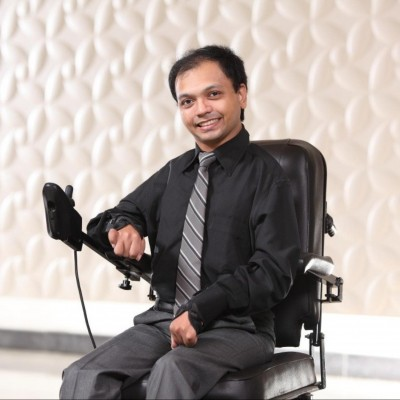

Ashwin Karthik established himself as a true achiever from the very moment of his birth. He was born with a deficient supply of oxygen, which resulted in a crippling and life-long condition called cerebral palsy. He is a quadriplegic, with the severest form of cerebral palsy that affects all four limbs. But, as though to balance his misfortune, he is blessed with an indomitable spirit and the will to take on an almost impossible challenge of leading and succeeding in a world full of people without disadvantages.

{:class="img-responsive"}

From his schools days, Ashwin’s record reflects what he has been striving to do earnestly. In 1999, Ashwin scored 84% in his SSLC exams; the highest percentage ever scored by a student with cerebral palsy. In 2003, he received the National Scholarship for his engineering studies, given to just one physically challenged student across the entire country. He is the first quadriplegic cerebral palsy student in India to have become an engineering graduate.

Ashwin worked with Mphasis for 7.5 years and then served ANZ almost 4 years as a business analyst. Currently is working in the capacity of an Advisor to project Management at DellEMC.

His choice of three heroes in life reflects his multi-faceted personality:
- His mother, who nurtured him and brought him up, harnessing her enormous will power, dedication and infinite love for her son.
- His second hero is Sachin Tendulkar, who Ashwin thinks has made a billion people happy, and has made each one of us feel proud to be an Indian. He hopes to emulate “at least a fraction of what Sachin has done for the spirit of his countrymen”.
- His third hero is the celebrated British theoretical physicist Stephen Hawking, who, though crippled by a neuro-degenerative disease, has made original contributions in the field of cosmology and quantum gravity.

We can see that Ashwin’s heroes are a well thought-out selection, reflective of his deep and rich perspective and his own aspirations: they traverse from a local and intensely emotional plane—though a sporting hero and an inspiring national icon—to an international and highly intellectual plane. Only a poet would have a mind-map like this!
Ashwin is indeed a poet. He writes poetry in English, Kannada and Hindi.

Below are the awards with he has been recognized with:
1.	Awarded with the young Achiever award by Rotary Midtown and Brigade group in the year 2009.
2.	Veer Savarkar award in the year 2009.
3.	Determination Icon of the year by Yuva Bengaluru award in the year 2010.
4.	Best Physically Challenged individual in India by National trus in the year 2010.(national award)
5.	Helen Keller award 2011. (National Award) for being the Role model.
6.	Positive Health award in the year 201by Dr Bathra’s.
7.	Best Employee Award given by the government of India and presented by President of India in the year 2013.
8.	2014 – Bangalore Youth Icon 
9.	2015 – Karamveer Puraskar High Achiever Award (Delhi) 
10.	2016 - Keynote speaker at Amazing Indians Times Now Group event (Delhi), where Prime Minister Narendra Modi was chief guest 
11.	Co-author of the book “The Relic the eternal search”
12.	Nipman Foundation & Microsoft Equal Opportunity Award 2019.

### Stay tuned

Follow this page as we continue to develop this page. We are hoping to inspire the next generation to action!
